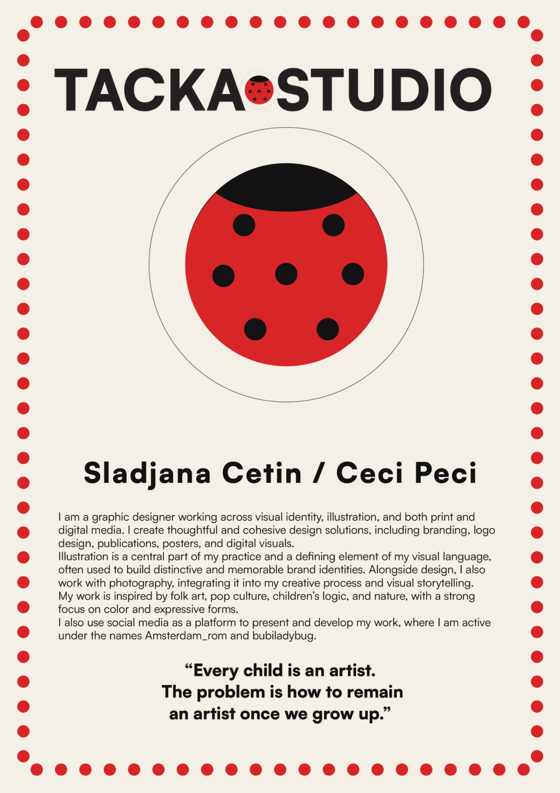
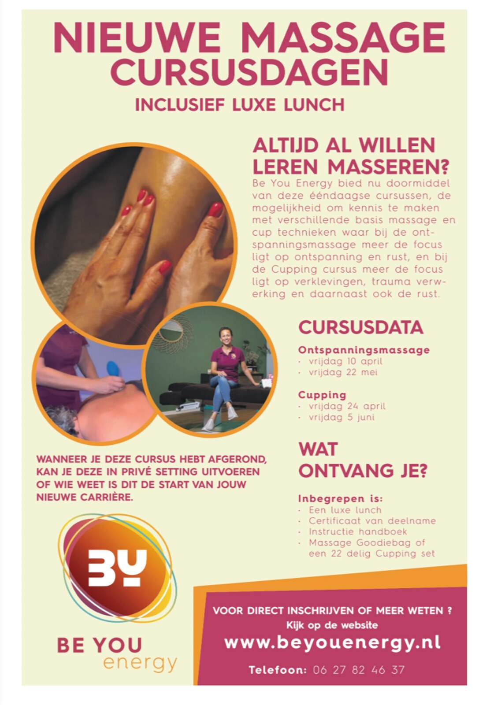
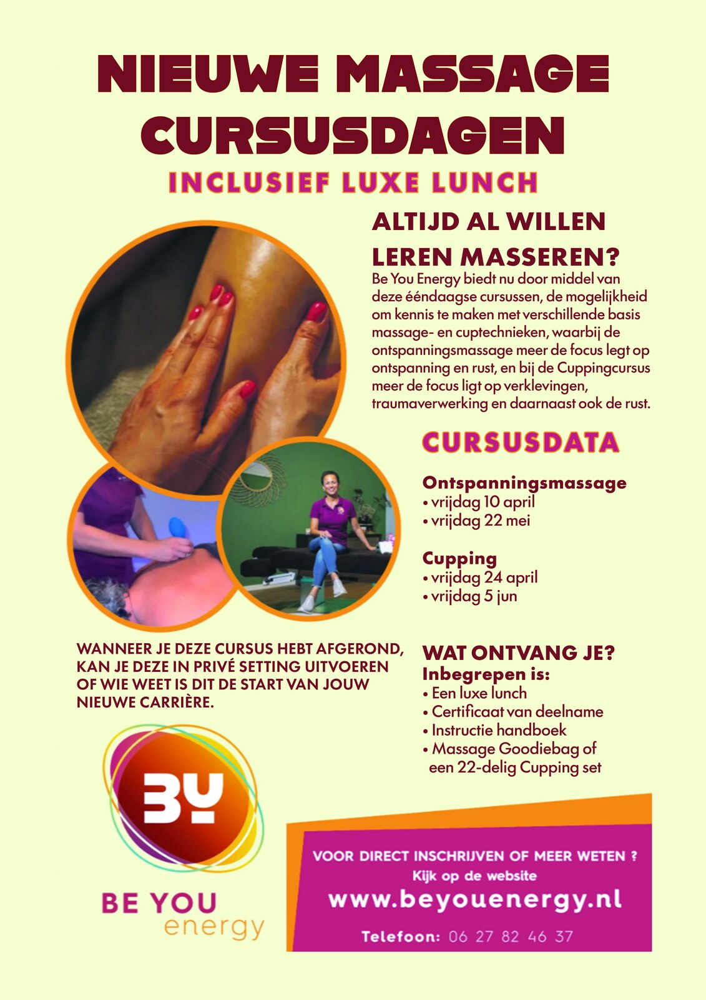
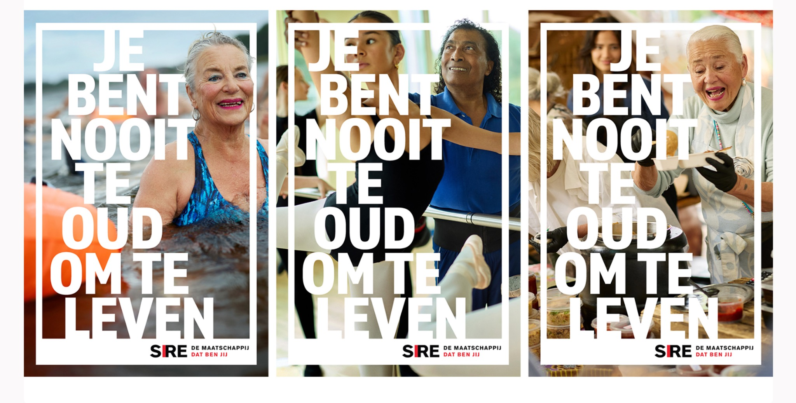
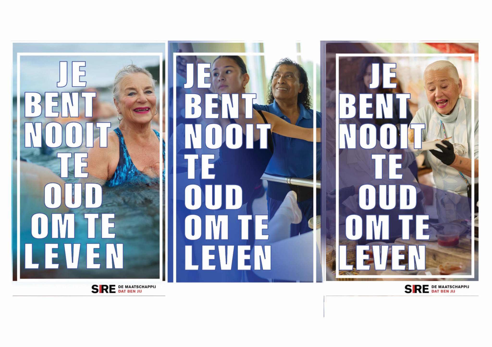
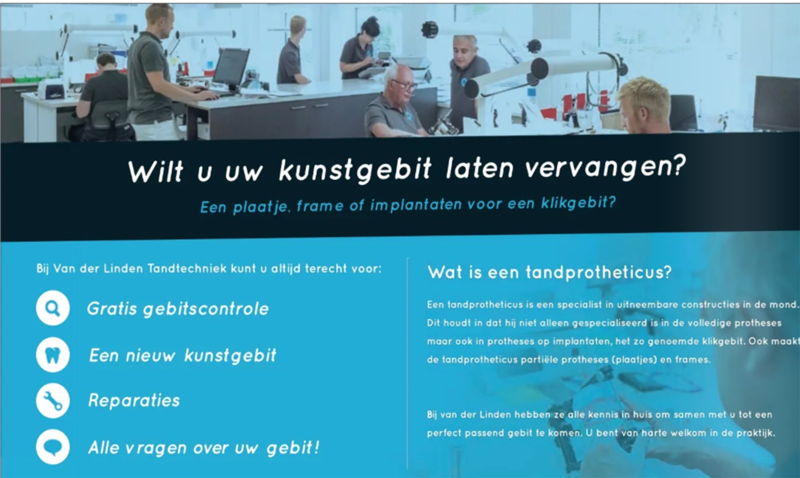
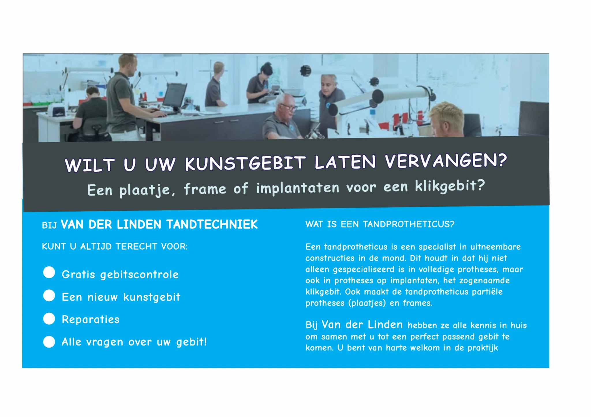

# TACKA STUDIO

## About

TACKA STUDIO is the creative practice of graphic designer and illustrator Sladjana Cetin, also known as Ceci Peci.

I work across visual identity, illustration, print, and digital media, creating thoughtful and cohesive design solutions that combine clarity, personality, and expressive visual storytelling.

I specialize in visual communication for active adults aged 50 and over, creating clear, contemporary, and engaging designs that reflect their diverse interests, experiences, and lifestyles.

## Creative Practice

My work includes:

- Brand identity and logo design
- Illustration
- Publications and editorial design
- Posters and promotional materials
- Digital and social media visuals
- Photography and visual storytelling

Illustration is a central part of my practice and a defining element of my visual language. My work is inspired by folk art, pop culture, children's logic, and nature, with a strong focus on color and expressive forms.

---

## Featured Project: Advertisement Redesign for Better 50+ Readability

### Before

### After

### Project Overview

This self-initiated redesign explores how an existing advertisement could be made clearer, more accessible, and easier to read for adults aged 50 and over.

I found the original advertisement in the Dutch publication *Senioren Krant* and selected it independently as an example with potential for improved visual communication.

For my redesign, I refined the color palette, increased contrast, and adjusted the typography, spacing, and visual hierarchy. The goal was to make the information easier to scan and read while preserving the advertisement's original content and identity.

Adults aged 50 and over are a diverse and active audience, yet their needs are still too often overlooked in visual communication. Good design for this audience should feel contemporary and engaging while offering clarity, legibility, and a comfortable reading experience.

### Design Focus

- Stronger text and background contrast
- Clearer and more legible typography
- Improved information hierarchy
- More consistent spacing
- Easier scanning of dates and key information
- A contemporary presentation designed with 50+ readers in mind

### Disclaimer

This is an independent, unsolicited conceptual redesign created for portfolio purposes. I was not commissioned by, and am not affiliated with, *Senioren Krant*, Be You Energy, or the original advertiser. All original brand names, logos, photographs, and written content belong to their respective owners.

---

## SIRE Campaign Redesign for Better 50+ Readability

### Before

### After

### Project Overview

I found this existing SIRE campaign online and independently chose to redesign the posters as a personal portfolio exercise. My goal was to make the message clearer and easier to read for adults aged 50 and over.

I improved the contrast, typographic hierarchy, alignment, and distribution of the text. Color overlays and outlined letterforms help the message remain visible across the different photographs. The original images and campaign message are preserved, while the redesigned layout is calmer, more consistent, and more accessible.

### Design Focus

- Improved text-to-image contrast
- Clearer typographic hierarchy
- More consistent alignment and spacing
- Better legibility across varied photographic backgrounds
- A calmer visual rhythm for comfortable reading
- Preservation of the original campaign message and imagery

### Disclaimer

This is an independent, unsolicited conceptual redesign created solely for portfolio and educational purposes. I was not commissioned by, and am not affiliated with, SIRE or the original campaign creators. All original brand names, logos, photographs, and written content belong to their respective owners.

---

## Dental Advertisement Redesign for Better 50+ Readability

### Before

### After

### Project Overview

I found this existing advertisement online and independently chose to redesign it as a personal portfolio exercise. My goal was to improve readability and accessibility for adults aged 50 and over.

I adjusted the typography, contrast, spacing, alignment, and information hierarchy. In the redesigned version, larger and more consistent type, clearer content grouping, and a simplified layout make the information easier to scan and more comfortable to read while preserving the original message.

### Design Focus

- Larger and more consistent typography
- Stronger contrast between text and background
- Clearer information hierarchy
- Improved spacing and alignment
- Simplified bullet points and content grouping
- A calmer, more accessible reading experience for the 50+ audience

### Disclaimer

This is an independent, unsolicited conceptual redesign created solely for portfolio and educational purposes. I was not commissioned by, and am not affiliated with, Van der Linden Tandtechniek or the original advertisement creators. All original brand names, photographs, logos, and written content belong to their respective owners.

---

## TACKA STUDIO

Distinctive visual communication with character, clarity, and a human touch.

---

**Sladjana Cetin / Ceci Peci**
